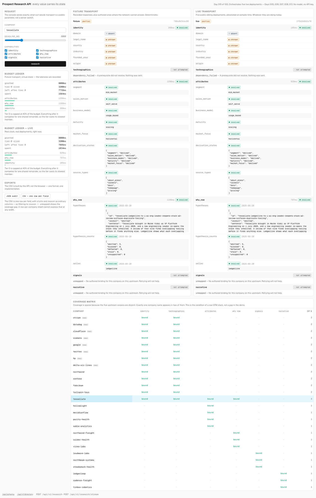
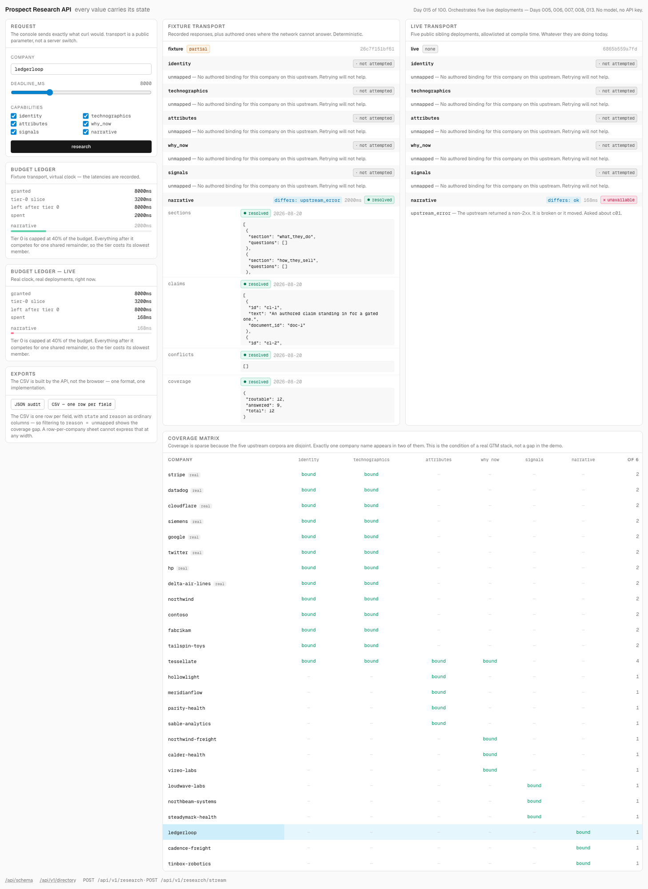

# Prospect Research API

A research service where every value arrives with the story of how it came to
exist — what state it is in, which upstream produced it, and why the ones that
are empty are empty.

[Live demo](https://prospect-research-api.vercel.app) ·
[`POST /api/v1/research`](https://prospect-research-api.vercel.app/api/schema) ·
[Coverage matrix](https://prospect-research-api.vercel.app/api/v1/directory) ·
[Plan](./PLAN.md)

Day 015 of a 100-day building challenge. It orchestrates five services shipped
earlier in the series — Days 005, 006, 007, 008 and 013 — and contains no
research logic and no model calls of its own.

## Why I Built This

The brief for this day reads *"a reusable service that returns structured
prospect research from a company input"*, which is Day 006 and Day 014 with a
`POST` in front of them. Both already shipped. The portfolio angle is what
actually names the subject: **API design, structured outputs, reusable GTM
infrastructure**.

So the research here is deliberately unremarkable. It is bought wholesale from
services that already exist. What is engineered is the response, and the hard
part is that upstreams are unreliable and every enrichment API pretends
otherwise.

A flat enrichment response gives you `headcount: 340` and you cannot tell whether
that is a current observation, a two-year-old cache, a vendor's estimate, or a
default that got filled in when the lookup timed out. Four specific failures live
inside that flat object:

**Absence is one word for four different things.** A field comes back empty. Did
the provider look and find nothing? Look and affirmatively determine there is
nothing to find? Never look, because the budget ran out? Try and get a 500? The
correct next action differs in all four cases — retry, stop asking, raise the
timeout, page someone — and `null` collapses them into a shrug.

**Partial success has no representation**, so it becomes a lie in one direction or
the other: a `200` that looks complete, or a `500` that throws away four good
answers and teaches your retry loop to hammer a service that is working fine.

**Coverage is hidden because it is embarrassing.** No vendor covers every account
and none of them will show you the matrix, because the matrix is sparse. So you
discover coverage one disappointing account at a time and build folklore instead
of reading a table.

**Identifiers do not line up, and the join gets guessed.** Six providers, six
private key spaces, no shared identifier, and in practice a fuzzy string match
nobody audits — which is a machine for attaching one company's facts to another
company's record.

## What It Does

One input: a company name. Six capabilities, each calling a sibling deployment.
One response in which **every leaf is a box**:

```jsonc
{
  "completeness": "partial",
  "fields": {
    "identity": {
      "domain":     { "state": "absent",   "reason": "ok", "capability": "identity", "upstream_key": "Tessellate" },
      "legal_name": { "state": "unknown",  "reason": "ok", "capability": "identity", "upstream_key": "Tessellate" }
    },
    "attributes": {
      "segment":    { "state": "resolved", "reason": "ok", "value": "mid_market",
                      "capability": "attributes", "upstream_key": "tessellate" }
    },
    "technographics": {
      "technologies": { "state": "not_attempted", "reason": "dependency_failed", "capability": "technographics" }
    },
    "signals": {
      "signal_events": { "state": "not_attempted", "reason": "unmapped", "capability": "signals" }
    }
  },
  "budget": { "granted_ms": 8000, "tier0_slice_ms": 3200, "remaining_after_tier0_ms": 7732, "elapsed_ms": 1564 }
}
```

Read that response and you know: Day 013 was asked about "Tessellate" and
affirmatively has no domain for it; its legal name is unknown for want of an
entity record; Day 014 resolved the segment; the tech stack was never requested
because there was no domain to inspect; and nobody has ever told this service how
to ask Day 005 about this company, so retrying will not help.

There is no path through that document that hands you a value without its state.

### Five states, ten reasons

| state | meaning |
|---|---|
| `resolved` | A value, and it means what it says. |
| `unknown` | The capability ran and found nothing conclusive. |
| `absent` | The capability ran and asserts the property does not exist. |
| `not_attempted` | The capability never ran. |
| `unavailable` | The capability ran and the upstream failed. |

| reason | what a caller should do |
|---|---|
| `ok` | Nothing. It ran and reported. |
| `deadline` | Never started; the budget was gone. Raise `deadline_ms`. |
| `dependency_failed` | A prerequisite did not resolve. Nothing was sent. |
| `unmapped` | No binding exists for this company on this upstream. Retrying will never help. |
| `upstream_error` | Non-2xx. The upstream is broken or it moved. |
| `upstream_unconfigured` | Reachable but not provisioned. Retrying is pointless. |
| `upstream_rate_limited` | Back off. `retry_after_s` carries the upstream's own advice. |
| `timeout` | Sent, then abandoned. This upstream is eating your budget. |
| `boundary_violation` | A 2xx whose body failed the schema. The upstream answered something else. |
| `excluded_by_caller` | You did not ask for it. |

`unknown` versus `absent` is the distinction every vendor collapses.
`not_attempted` versus `unavailable` is "your budget" versus "their outage".
Eight of the ten reasons determine the state completely; only `ok` is ambiguous,
which is why the two axes are both transmitted and neither can contradict the
other.

## Demo

The console. Left is the counterfactual world — recorded responses, with authored
ones where the network cannot answer. Right is the five deployments, right now.



The side-by-side is not decoration. Here is `ledgerloop`, where the two worlds
disagree: the fixture column has a brief, and the live column reports what Day
006's deployment actually does today.



```bash
curl -sX POST https://prospect-research-api.vercel.app/api/v1/research \
  -H 'content-type: application/json' \
  -d '{"company":"tessellate","transport":"live","deadline_ms":8000}'

# Streaming: each capability as it settles
curl -NX POST https://prospect-research-api.vercel.app/api/v1/research/stream \
  -H 'content-type: application/json' -d '{"company":"datadog","transport":"live"}'

# One row per field
curl -sX POST https://prospect-research-api.vercel.app/api/v1/research/csv \
  -H 'content-type: application/json' -d '{"company":"tessellate"}'
```

## How It Works

A company name is resolved against this service's own directory — exact match
over authored aliases, no stemming and no edit distance, because a near-miss is
a miss and research about the wrong company is worse than none.

Then one budget is spent across two tiers:

```
  company name
       │
  canonical directory ──── miss ⇒ 404, with the directory listed
       │
  scheduler:  tier0_slice = min(0.4 × deadline_ms, 4000)
       │
  ┌────┴─────┐                          the one dependency edge
  │ identity │ ── resolved domain ──▶ technographics
  │ (Day 013)│                          (Day 008)
  └────┬─────┘
       │  remainder, shared concurrently
       ├──▶ attributes (Day 014)   ├──▶ signals   (Day 005)
       ├──▶ why_now    (Day 007)   └──▶ narrative (Day 006)
       │
  envelope builder ── boxes every leaf, derives completeness
       │
  POST /api/v1/research · /stream · /csv
```

There is exactly **one** dependency edge, and it is stated as one edge rather
than dressed up as a general DAG: `techstack-icp` needs a URL and only
`domain-detective` produces one. The other four capabilities are keyed on their
own identifier spaces and run regardless. When identity does not resolve — which
happens for a real reason on Stripe, where Day 013 returns three surviving
domains and refuses to pick — `technographics` reports
`not_attempted/dependency_failed` and names no upstream key, because naming one
would imply an attempt that never happened.

### The upstreams, as they actually are

Probed before any code was written, and the table is a design input rather than
an aspiration.

| capability | upstream | binding shape | observed |
|---|---|---|---|
| `identity` | Day 013 `domain-detective` | free-form `{ query }` | works; `ambiguous` for Stripe, `under_posed` for HP, `succeeded_by` for Twitter |
| `technographics` | Day 008 `techstack-icp` | `{ url, asOf }` — needs a domain | works on real domains; rate-limited 6/min; `.example` hosts 502 |
| `attributes` | Day 014 `company-classifier` | `{ companyId }` — its own keys | works for its own 24 companies only |
| `why_now` | Day 007 `why-now` | `{ companyId, sellerId }` | works for its own 12 companies only |
| `signals` | Day 005 `signal-scout` | a whole `{ accounts, observations, watchlist, as_of }` payload | works; the binding is a *request*, not an id |
| `narrative` | Day 006 `account-brief` | `{ company_id }` | **returns `404 text/html`** today |

### Coverage is sparse, and that is the finding

The five upstream corpora are **disjoint fictional company sets**. Day 014 knows
Hollowlight and Meridianflow. Day 007 knows Northwind Freight and Calder Health.
Day 005 knows Loudwave Labs. Day 006 knows Ledgerloop. Day 013 knows twelve real
companies and twelve RFC 2606 synthetics. Exactly **one** name appears in two of
them: Tessellate.

Measured from the shipped directory: 13 companies bound to one capability, 12 to
two, and Tessellate to four. Nothing reaches six.

So "resolve a domain, fan out to six providers, merge" — the design any
orchestrator reaches for first — cannot work. That is not a flaw in the demo; it
is the condition of every real GTM stack, and the honest response was to make the
mismatch the subject. Bindings are **authored one at a time**, and there is no
string-similarity code anywhere in this repository: `northwind` (Day 013) and
`northwind-freight` (Day 007) are different fictional companies, and a
normalise-then-compare join would merge them and confidently attach one
company's timing hypotheses to another company's domain.

## Architecture

Four layers, and the boundaries between them do work:

- **`lib/envelope/`** — the box, the two closed vocabularies, document assembly,
  completeness. Pure; knows nothing about HTTP or upstreams.
- **`lib/capabilities/`** — one provider per upstream, each declaring its binding
  shape and its boundary schema. Providers describe a request and validate a
  response; they perform no I/O, which is why every boundary rule is testable
  without a network.
- **`lib/transport/`** — the seam. `fixture` replays committed recordings;
  `live` performs HTTP against a compile-time host allowlist. Every non-2xx,
  unparseable body and rate-limit header is translated into a state/reason pair
  *here* and never above.
- **`lib/scheduler/`** — one budget, the tier slice, the dependency edge, cascade
  accounting.

The console is a client of the published API with no privileges. It imports
nothing from `lib/`, hand-writes its own types from the schema, and drives the
capability list off `/api/v1/directory` rather than a local copy. A sweep
invariant fails if any rendered field path is absent from `/api/schema`, because
"API-first" left to good intentions becomes a README adjective within a day.

## Key Decisions & Tradeoffs

**`200` for any document produced, including one where nothing resolved.**
Because an upstream being down is not this service failing, and a truthful report
of a degraded world is the successful outcome. `207` is WebDAV multi-status and
`206` is a byte range; more importantly, demoting a good response to a non-2xx
teaches every retry loop to hammer a service that is working correctly. Some
reviewers will disagree, and that objection is named here rather than hedged
around. *Tradeoff:* a client that routes purely on status code sees no difference
between complete and empty, so completeness is published twice — in the body and
in `X-Research-Completeness`.

**Every leaf is boxed. No naked primitive anywhere.** A provenance sidecar keyed
by JSON path would be more compact, and it would make ignoring the state the path
of least resistance. *Tradeoff:* the response is verbose. A 27-field document for
one company is roughly 6 KB, and one row per field is why the CSV export exists.

**No model. No API key. Zero LLM calls.** Every upstream already spends its own
model quota; this service's work is resolution order, budget arithmetic, boundary
validation and envelope construction, and none of that wants a model. *Tradeoff:*
if you came expecting an AI project, the intelligence here is all upstream.

**Sync with a caller-declared deadline, no job store.** Partial success needs a
deadline, not durable storage. *Tradeoff:* no async submission, no idempotency
keys, no response cache — all three need a store, and claiming idempotency without
one would be worse than not having it.

**Bindings are authored, never inferred.** *Tradeoff:* coverage is sparse and
adding a company is manual work.

**`signals` is bound only for synthetic companies.** Binding it means shipping
observations *about* a company. For fictional ones that is authoring consistent
fiction; for Stripe or Siemens it would be publishing fabricated factual claims
about an identifiable third party in a public repository. Day 013 drew this line
inside its own corpus and this repo honours it. *Tradeoff:* real companies cap at
2-of-6.

**Sibling repositories were not modified**, including the one whose `POST` route
404s. Adapting to upstreams as they are is the job.

## Validation / Testing

```bash
npm test           # 118 unit tests
npm run sweep      # 9,828 documents, eight invariants, no network, ~1.2s
npm run typecheck
npm run build
npm run probe      # re-derive the coverage matrix from the live deployments
```

The sweep runs the full cross-product — 26 companies × 63 capability subsets × 6
deadlines — and asserts eight properties:

1. **No naked values.** Walk every document; fail on any primitive outside a box.
2. **State/reason legality.** `resolved` never carries `deadline`;
   `upstream_key` is present exactly when a request was sent; `retry_after_s`
   appears only under rate limiting.
3. **The dependency edge holds.** `technographics` never runs without a resolved
   domain.
4. **Determinism.** Same `request_digest` ⇒ byte-identical document, excluding
   `budget` and `request_id`.
5. **Budget monotonicity.** Raising `deadline_ms` never turns a resolved field
   into an unresolved one. This is the invariant that earns the script — a
   scheduler non-monotonic in its budget is broken in a way no single test case
   catches, and three plausible scheduling heuristics were discarded for
   violating it.
6. **`completeness` is derived** and can never disagree with the body.
7. **Tolerant read, strict require.** Unrecognised upstream keys are ignored;
   dropping each required key in turn must be reported rather than tolerated.
8. **Nothing outside the published schema** reaches a document.

It also asserts **seven named scenarios** by name — five observed from the live
deployments, two constructed, and which is which is labelled — plus four
**vocabulary probes**. The probes exist because the sweep's own report showed
that four of the ten reasons are produced by no document in the entire
cross-product: a closed vocabulary with unproducible members is a claim to handle
cases that are in fact unhandled, so the sweep now fails if any reason is
reachable by neither a document nor a probe.

**Fixtures are recordings.** `scripts/record.mts` captured 36 responses from the
live deployments, and running it invalidated three boundary schemas written from
memory of a sample response — most consequentially that a `verified` verdict
carries `domain` rather than `survivors[0]`, which meant every company that
actually resolved was being reported as `unknown`. That bug passes a hand-written
fixture forever. Anything the network cannot produce is authored, labelled
`origin: "authored"`, and kept in a separate store from the recordings.

## Getting Started

### Prerequisites

Node 20+. No API keys, no environment variables, no database.

### Run locally

```bash
git clone https://github.com/akshatiwarix/prospect-research-api
cd prospect-research-api
npm install
npm run dev
```

The whole console works keyless on the fixture transport. The live transport
needs no credentials either — the five sibling hosts are public and the allowlist
is compile-time data in `data/upstreams.ts`.

### Usage

```ts
import { createClient } from "./lib/client";

const client = createClient({ baseUrl: "https://prospect-research-api.vercel.app" });
const document = await client.research({ company: "tessellate", transport: "live" });

// Resolves for complete, partial and none alike — a degraded document is a 200.
for (const [capability, fields] of Object.entries(document.fields)) {
  for (const [name, box] of Object.entries(fields)) {
    if (box.state === "resolved") console.log(capability, name, box.value);
    else console.log(capability, name, `${box.state}/${box.reason}`);
  }
}
```

Two runnable consumers over the public contract live in [`examples/`](./examples):

```bash
npm run example:coverage -- https://prospect-research-api.vercel.app live
npm run example:stream   -- https://prospect-research-api.vercel.app datadog live
```

## Limitations

- **Coverage tops out at 4-of-6, and most companies sit at 1 or 2.** The five
  upstream corpora are disjoint and authored evidence about real companies is off
  limits. The matrix will not get denser by trying harder.
- **The counterfactual world is authored.** It shows what a complete document
  looks like. It is not evidence that six providers would agree in reality.
- **Determinism is a fixture-transport guarantee only.** The live transport
  promises nothing of the kind.
- **No idempotency, no caching, no async jobs.** All three need durable storage,
  refused deliberately.
- **One dependency edge is a small graph.** The scheduler is honest about a
  two-tier world; it is not a general DAG executor.
- **The deprecated field is a demonstration.** A repo this young has nothing
  genuinely deprecated, so `fields.technographics.tech_stack` was renamed on
  purpose to make the deprecation path real and testable — it aliases its
  replacement by reference so the two cannot drift, and carries `Sunset` headers
  per RFC 8594 for a date this repository will probably not outlive.
- **The corpus is fiction, mostly.** The synthetic companies are authored and the
  `.example` domains are reserved by RFC 2606. The twelve real companies carry
  only factual, benign observations inherited from Day 013.

## What I'd Build Next

Kept out of this build deliberately, not forgotten: async job submission with a
durable store; `Idempotency-Key` and a response cache; a `?shape=flat` projection
for callers who accept the risk; authentication and per-caller quotas; batch
input; a general DAG scheduler; and a second schema version, so migration is
demonstrated across two live versions rather than one deprecated field.

## License

MIT. See [LICENSE](./LICENSE).
